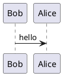
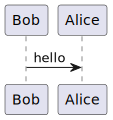

# *PlantUML* Client


## Introduction


This script can enumerate [***PlantUML***](https://plantuml.com) scripts in a directory, send them to the *PlantUML* server and download the built diagrams to a directory.

## Usage

The following command sends all `.puml` files in the `docs` directory to the *PlantUML* server, then downloads `.png` diagrams to the `images` directory.

```console
PS> .\Build-PlantUML.ps1 -ScriptDirectory 'docs' -DiagramDirectory 'images'
```



For example, the above script `hello.puml` will be built as `hello.png`.



This command sends all `.txt` files in the current directory to the *PlantUML* server, then downloads `.svg` diagrams to the current directory.

```console
PS> .\Build-PlantUML.ps1 -ScriptExtension 'txt' -DiagramExtension 'svg'
```

## License

Distributed under the *MIT License*. See `LICENSE` for more information.